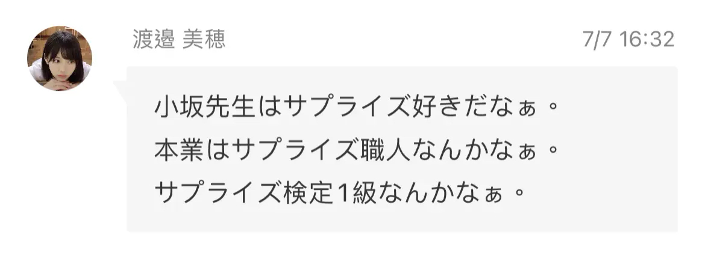

# SurpriseCertification

A certification to people who can make a big surprise. Award this to who is a surprise maker.🎉🎊
为可以创造惊喜的人设计的认证，请将你认为可以创造惊喜的人加入这个认证。🎉🎊

This repo can be used to learn Git.
这个仓库可以用来练习 Git 软件的使用

### Inspiration

Kosaka's surprise for Mihosan who graded from Hinatazaka46 several days age.
灵感来源于来自日向坂46的小坂鱼为已经从组合毕业的渡边美穗创造惊喜后美穗的博客。

### Usage 

1. fork this repo.
2. append the name of who you are thinking can make surprise to `NAMELIST.md`.
3. append your name to `Contributor.md`
3. send pr.

